<p align="center">
  
</p>

<h1 align="center">Dustvalve Next</h1>

<p align="center">
  <b>An emotional music player for Android, made with intention</b><br/>
  Touch, swipe, drag, double-tap, and slide your way through Bandcamp, YouTube, and your local library.
</p>

<p align="center">
  
  
  
  
  
</p>

<p align="center">
  <a href="https://github.com/Pingasmaster/dustvalve_next/releases/download/v0.3.42/app-release.apk"></a>
</p>

---

<details>
<summary><h2>Screenshots</h2></summary>

<p align="center">
  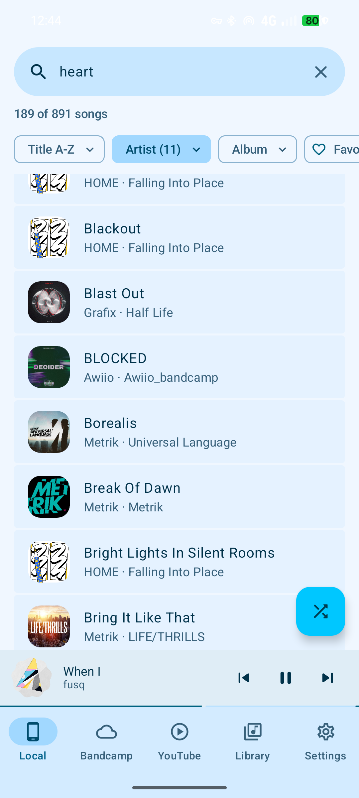
  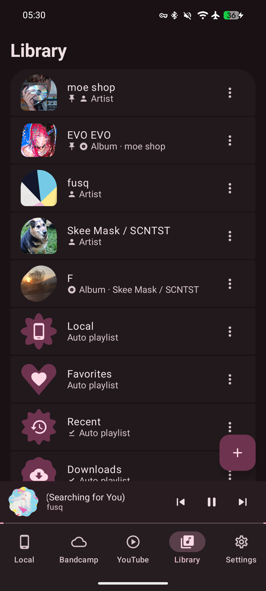
  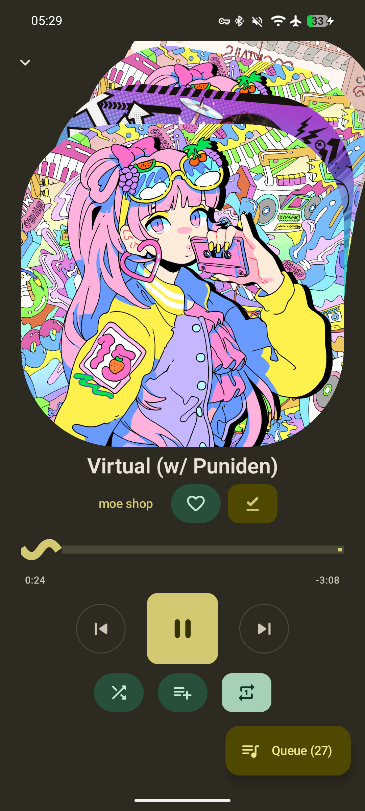
  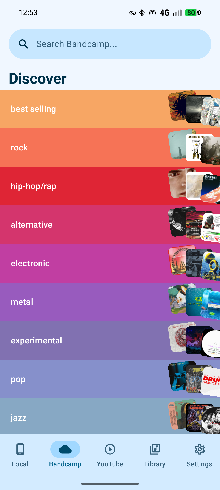
  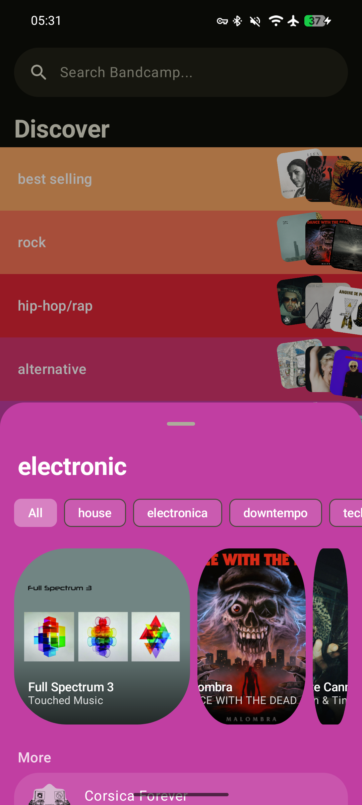
  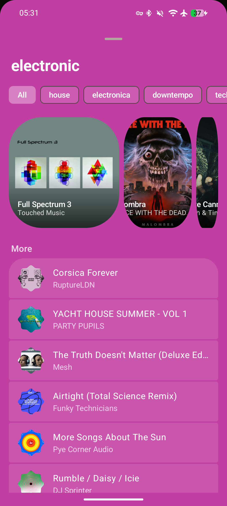
  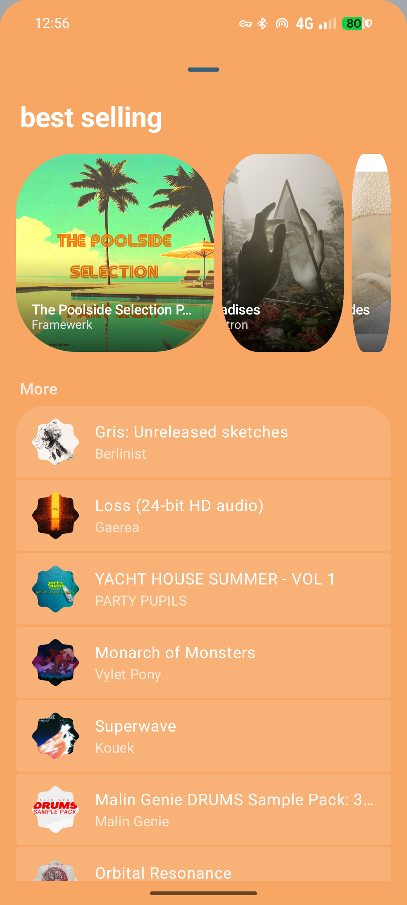
  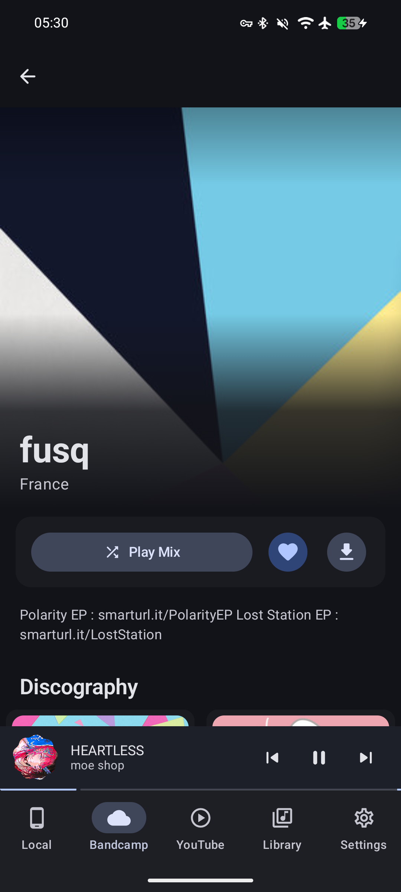
  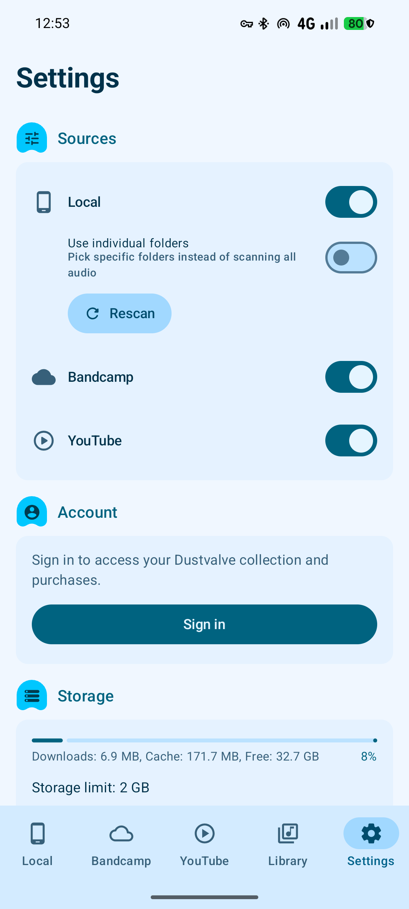
  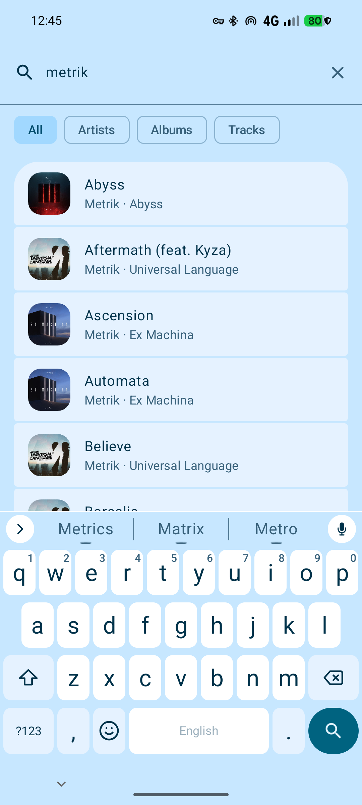
  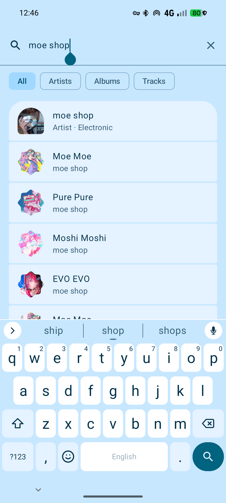
  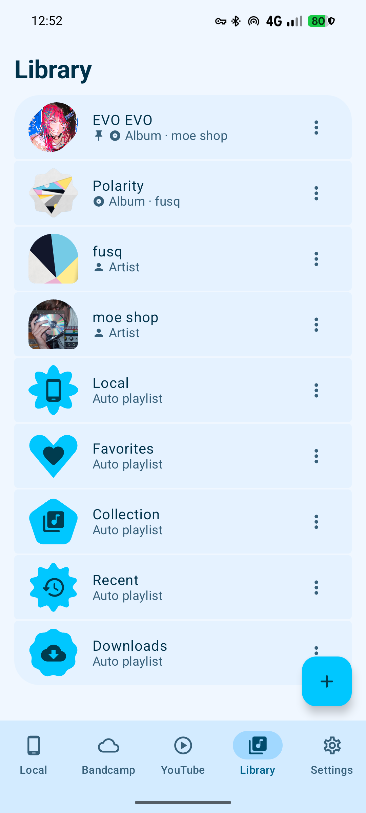
  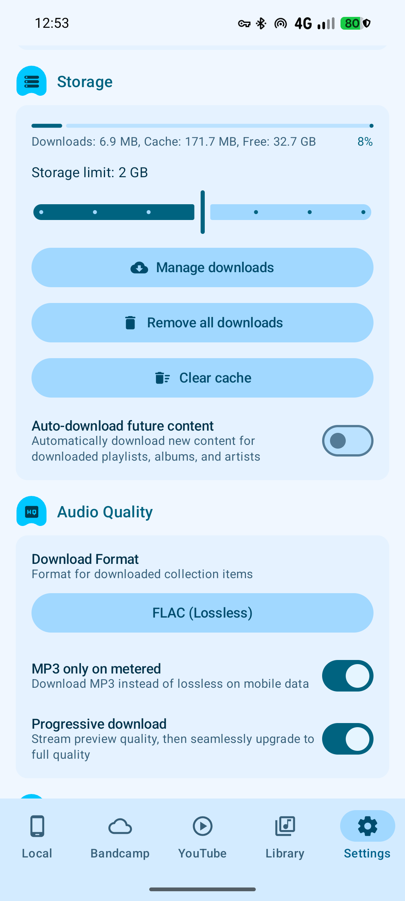
  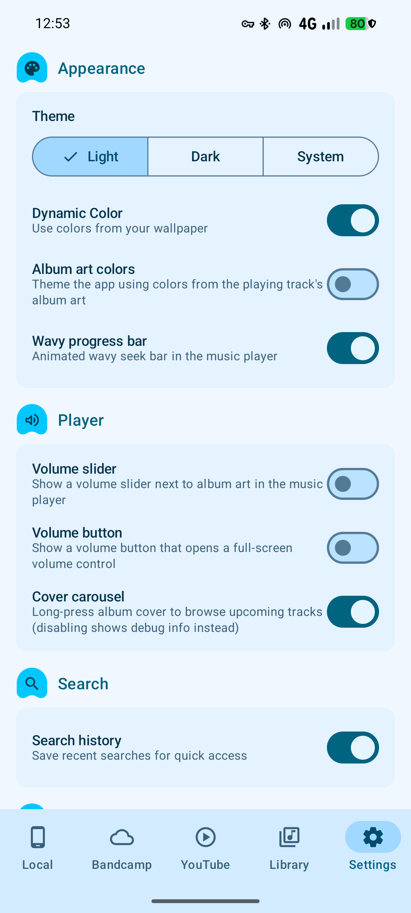
  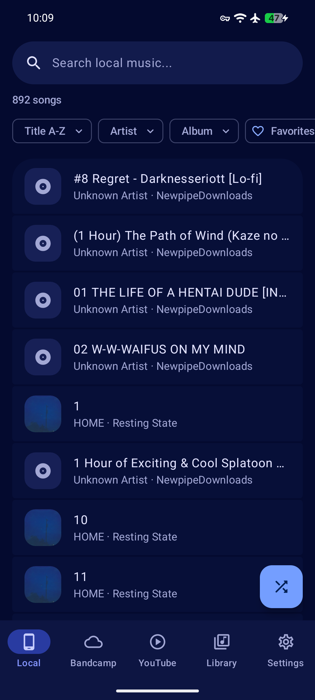
  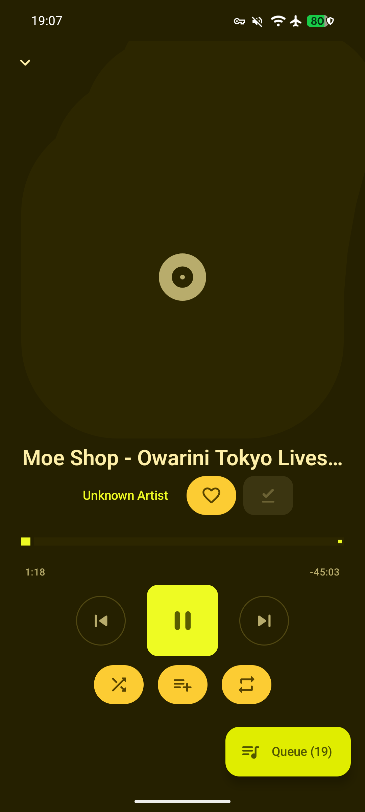
  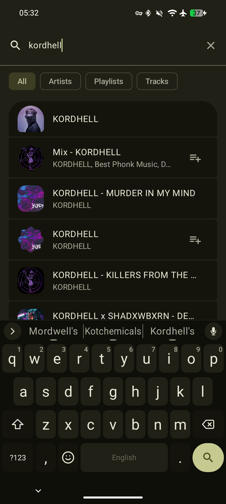
  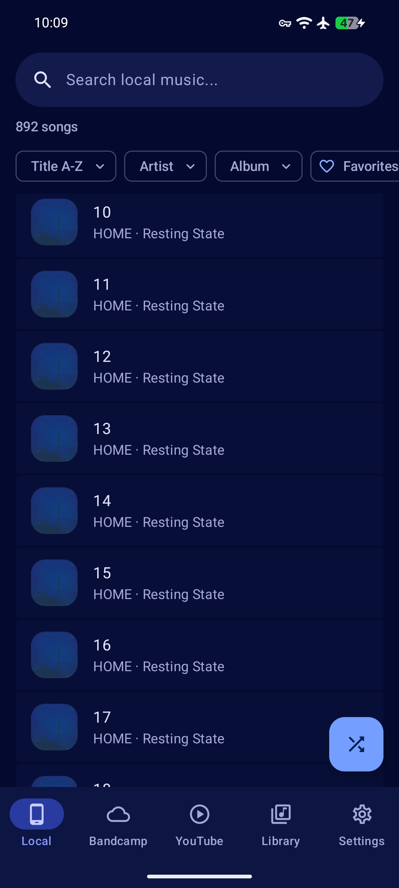
</p>

</details>

## About

Play your music from a single, snappy and emotional interface no matter the source: bandcamp, youtube music, or just your local music folder.
See your favorite artists, albums, playlists and songs in a single page and add songs to your playlist without worrying about where they come from, all in a nicely designed, lightweight (~7MB download), extremely fast and no-nonsense GPLv3 Material you 3 Expressive app.

> **Pre-alpha**. Report any bugs. We will add more sources once we get out of alpha and have unified the player features. Spotify is currently broken as is account link for any platforms.

The latest release can be found [here](https://github.com/Pingasmaster/dustvalve_next/releases). Thank you so much for trying it!

## Features

We provide progressive streaming, automatic caching (never redownloads a song or album cover more than once) and optional downloads for all platforms. Also, the main music player is pretty intuitive and not boring like other apps.

We have no tracking or bullshit, you choose whether you want to allow music access storage permissions or per-folder access which does not require any storage permissions at all. This software is designed to respect you and your privacy. We provide instructions to build the app yourself from this repo in the build section.

We heavily follow all Material you 3 Expressive guidelines and recommendations with a touch of expressiveness on top to make it all as much android-native and intentional as possible, though I'm a dev not a designer so feel free to create some Issues for any suggestions. The APK is ~7MB (classes.dex and resources ship uncompressed for faster install and lower runtime memory on Android 13+), takes around 32Mb of storage space once installed, has configurable caching storage limits and most importantly starts up instantly, no splash screen for 5 seconds on slow devices.

**Gestures**
- **Tap** album art to play/pause, **double-tap** to favorite
- **Swipe** album art left or right to skip tracks
- **Long-press** album art to browse upcoming tracks in a carousel
- **Drag** the seek bar or volume slider to scrub and adjust
- **Swipe** queue items or playlist tracks to remove them
- **Long-press and drag** handles to reorder queue and playlists
- **Long-press** library items for context menus
- **Tap** stacked covers behind the album art to jump to upcoming tracks

## Building from source

**Requirements:** Java 21, Android SDK 37

If you just want an apk to install to your device:

```bash
git clone https://github.com/Pingasmaster/dustvalve_next.git
cd dustvalve_next
./gradlew assembleRelease
```

Release builds are signed with the Android debug keystore (auto-generated by the Android Gradle plugin on first build). No keystore setup is required.

> You should compile the code yourself to make sure it's good anyway; that's why we removed key signing in the first place. Download the source, read the diff, and assemble your own APK rather than trusting a prebuilt one.

For devs who want to modify, fork and test the app, we have a build script which runs lint, assembles debug and release APKs, copies the release APK to the project root as `app-release.apk`, and auto-increments the version.

```bash
./build.sh
```

## Contributing

Contributions are welcome, but this music player was originally built for myself because I found the bandcamp app to be lacking in design and speed. If it makes sense I'll merge it.

## License

Dustvalve Next is licensed under the [GNU General Public License v3.0](https://www.gnu.org/licenses/gpl-3.0.html).

<p align="center">
  
</p>

